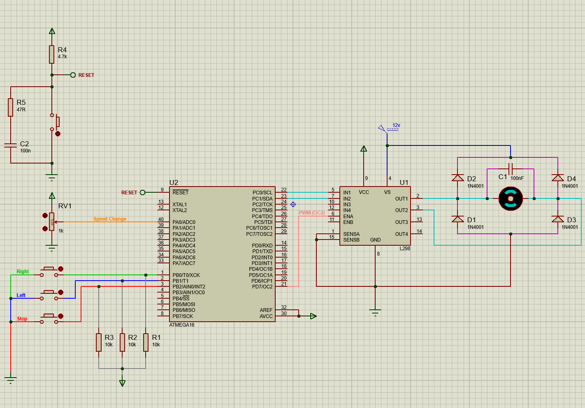

# DC Motor Speed and Direction Control with PWM on ATmega16

This is a university-level educational project: a simple and practical DC motor control system built with the **ATmega16 microcontroller**, a **potentiometer** for speed adjustment, and the **L298 motor driver IC** for motor power control.  
In this project, motor speed is regulated using **PWM (Pulse Width Modulation)**, while motor direction is controlled using digital push buttons (right, left, and stop).

&nbsp;

## 🚀 Features
- DC motor speed control using a potentiometer and PWM  
- Motor direction control: **right, left, stop**  
- Based on the **ATmega16** microcontroller  
- Uses the **L298** motor driver IC  
- Simulated in **Proteus**  
- Programmed in **CodeVisionAVR**

&nbsp;

## 🧩 Required Components
- **ATmega16** microcontroller  
- **L298** motor driver IC  
- Potentiometer for speed adjustment  
- Push buttons for direction control  
- DC motor  
- Suitable power supply  
- Breadboard, jumper wires, and necessary connections

&nbsp;

## 🖥️ Simulation
This project has been fully simulated in **Proteus**.

### Simulation Image

&nbsp;

## 🛠️ Software Used
- **Proteus** for circuit simulation  
- **CodeVisionAVR** for programming the ATmega16

&nbsp;

## ⚙️ How It Works
- The potentiometer is connected to the ADC input of the **ATmega16** microcontroller.
- The microcontroller reads the analog voltage from the potentiometer and converts it into a PWM duty cycle.
- The PWM signal is generated using **Timer2**.
- The **L298** motor driver IC amplifies the control signals and drives the DC motor.
- Push buttons are used to control the motor direction:
  - **Right**
  - **Left**
  - **Stop**

&nbsp;

## 🧠 Code Description
The main program is written in **C** and is located in the **"DC Motor Control.c"** file.

It includes:
- ADC reading from the potentiometer  
- PWM generation using **Timer2**  
- Direction control via **PORTC**  
- Button input reading from **PORTB**

&nbsp;

## 🎓 Educational Purpose
This project was developed as a university-level educational project to demonstrate:
- PWM control  
- ADC usage  
- DC motor speed control  
- Motor direction control  
- Microcontroller and driver IC interfacing

&nbsp;

## 📄 License
This project is open-source and available under the MIT License.

&nbsp;

## Feedback & Contact
Thank you for visiting this repository 🙏🏻

If you found this project useful, feel free to:
- leave a comment,
- open an issue,
- or suggest improvements.

If you like this project, please consider starring the repository ⭐  
Thanks for your support!

&nbsp;

## 📬 Contact Me
Feel free to reach out through any of the following platforms :

  
  

&nbsp;

### 💡 Quick Note
Have a question or want to collaborate? Drop me a message anytime!

Best regards,  
**Shahzad** ❤️

&nbsp;

> ⭐ If this project helped you, don’t forget to star the repository!
